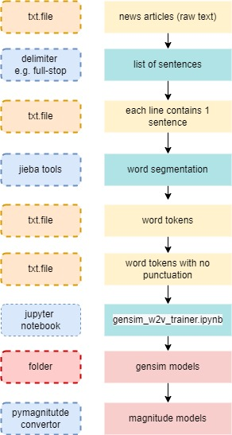
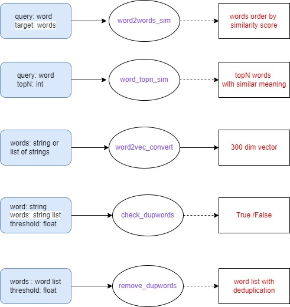

## Introduction of gensim word2vec model
Please refer to this url : https://towardsdatascience.com/a-beginners-guide-to-word-embedding-with-gensim-word2vec-model-5970fa56cc92

This repository focuses on how to train and deploy a self-developed word2vec model to reflect the word semantic relationship for Traditional Chinese Financial news.

## Background of this word2vec model

To balance between training and deployment, we use two differents set of open libraries for model training and deployment, respectively.
- training: [gensim](https://github.com/RaRe-Technologies/gensim)
- deployment: [pymagnitude](https://github.com/plasticityai/magnitude) for model format conversion and [pymagnitude-light](https://github.com/davebulaval/magnitude-light) for loading of trained model.
 
## why use [gensim](https://github.com/RaRe-Technologies/gensim) for model training?
[gensim](https://github.com/RaRe-Technologies/gensim) is designed to process raw, unstructured digital texts (”plain text”) using unsupervised machine learning algorithms.

The algorithms in Gensim, such as Word2Vec, FastText, etc, automatically discover the semantic structure of documents by examining statistical co-occurrence patterns within a corpus of training documents. 

Gensim is fully optimized to train a word embedding/word2vec model on local CPU environment(Non-GPU) with large dataset. Given the optimization of open-library, the training will take about 30 mins to complete based on the training dataset in the data folder 

--------------------------------------------------------------------------------------------------------------------------------------------------------------------------

### Model training workflow

--------------------------------------------------------------------------------------------------------------------------------------------------------------------------

## Model training environment
To reduce the consumption of computing resources during the model training process, user can fine-tune the numbers of workers in the instantiation of Word2Vec model shown below. 

We strongly advise to use google colab platform for training to reduce the resource burden of local machine. Please remember to register a google drive account before using google colab. Please remind no need to change instance to GPU when using gensim for word2vec model training as Gensim is cpu-only applicable.

### hyperparameter to control computing resources

 

## why use pymagnitude for deployment?

Gensim word2vec model cannot handle out-of-vocabulary (OOV) issue. The gensim-based model will raise error when the input string contains new terms and vocabularies which do not exist in the model dictionary stored in the model file. (e.g. NFT , Metaverse, etc)

To alleviate the OOV problem, we convert the gensim word2vec model to magnitutde format and load the model by [pymagnitude](https://github.com/plasticityai/magnitude) as pymagnitude is designed to load word2vec model with OOV strings as input and it intreprets OOV based on the sequences of characters.

### The commmand line for model conversion
- general:     python -m pymagnitude.converter -i <PATH TO FILE TO BE CONVERTED> -o <OUTPUT PATH FOR MAGNITUDE FILE>
- this repository:    python -m pymagnitude.converter -i  \word2vec_training\model\gensim\etnet_w2v.bin   -o  \word2vec_training\model\magnitude\boc_app_heavy.magnitude 

For the script and command line to convert gensim  to magnitude format, please refer to the github page of [pymagnitude](https://github.com/plasticityai/magnitude)
 
### Gensim model conversion to magnitude
 
  
For the detail of how to deploy word2vec model by  [pymagnitude](https://github.com/plasticityai/magnitude) and   and [pymagnitude-light](https://github.com/davebulaval/magnitude-light), please refer to the [deployment.py](https://github.com/etnetapp-dev/nlp_w2v_model/deployment.py)

------------------------------------------------------------------------------------------------------------------------------------------------------------------------
 
## Training of word2vec by gensim

### Training dataset

If local RAM is large enough, please increase the size of training data and data variety in order to achieve higher model accuracy.

In this repository, the training dataset is the combination of three dataset sources 
1. THUCNews (a well-known and widely used NLP dataset containing news articles about finance, gaming, fashion). The dataset can be easily searched and downloaded from internet
 
### ThUCnews dataset from internet

  
2. [Financial related articles from etnet lifestyle columns](https://github.com/etnetapp-dev/nlp_w2v_model/tree/master/data/lifestyle_finance/tokens)

3. [selected ETNET financial news articles produced between 2018 and 2020](https://github.com/etnetapp-dev/nlp_w2v_model/tree/master/data/etnet_news/tokens)

### data preparation
- input format of word2vec model : list of string list.
- raw string or text data cannot be directly used as model input

The pre-processing of Chinese text training dataset includes:
1. Seperate each articles into paragraph
2. split paragraphs into sentences by using Punctuation Marks, e.g. Comma,  Dash, Ellipsis, full-stop,etc.
3. Inplement word segmentation or tokenization on each sentences by using jieba open-library with our self-built [jieba user dictionary](https://github.com/etnetapp-dev/nlp_w2v_model/userdict.txt)
4. Remove the seperator punctuation (note: some punctuations can be retained in order to maintain a complete meaning of the words, e.g. Brackets,  Colon, etc.)
 
The post-proprocessing training dataset should be in the following format:
- Each line is one indepedent sentence
- Words are split off by spaces.  

### Example of training dataset
    
  
### Remark in data preprocessing
- if sentences contain both Chinese and English vocabulary, e.g. Donald Trump, Trump Trump, Alan Greenspan,etc., user can concatenate English words by removing the space, e.g. DonaldTrump, TrumpTrump.
- Some specific vocabularies can only be proprocessed or identified by manual checking. It is very time consuming and some degree of manual checking is neccessary in order to increase data integrity. For the dataset in the repository, we spent 1 month on both data preprocessing and checking.
- The post-processing datasets are stored in txt. file with '\n' to split of sentence and space for word segmentation.

------------------------------------------------------------------------------------------------------------------------------------------------------------------------
### loading training dataset in jupyter note book 

There are two python functions for loading training datasets from txt. files to python scripts and please specify the data file path when using the jupyter notebook in your local machine or google colab.

### dataset input function
  
  
After loading the dataset by the defined functions, the datasets format will be list of string list. Each item in the list represent one independent sentence and each string list represents a word segment of one sentence. 
  
### model input

## Model training : setting of hyperparameter

After loading training dataset, please specify hyper-parameters in section 5.1 of the jupyter notebook. For the definition of hyper-parameters, lease refer to this url: https://blog.csdn.net/szlcw1/article/details/52751314

Based on our experience, the 30 iter is enough for the exisiting dataset and the model performances are somehow similar by setting size (dimension) at 300-500. 
 
### definition of Hyperparameters

 
## Model Training process

After setting hyperparameters, please run the code in section 5.2-5.3 for model training. The overall training process will take about 30 mins in local machine and 15-20 min in google colab
 
Section 5.5 in jupyter notebook are the codes to store the trained model into local machine or indicated folder path. 
  
### gensim model after training

## Remark of model training
- Please dont save the model immediately after training. Instead, please use the function in section 5.4 in jupyter notebook to test the accuracy of the model
- If the top N related keywords output by the model are not semantically relevant to the input word, please retrain the model with different sets of hyperparameters e.g. adjusting the window size or changing sg from 0 to 1. 
- The setting of hyperparameter varies along with dataset and please adopt the try and error method to optimize the setting of model

  
### gensim model test

  
------------------------------------------------------------------------------------------------------------------------------------------------------------------------

### Model type conversion

The final step before deployment is model format conversion from gensim to magnitude.
 
Please only deploy the model after conversion in order to avoid out-of-vocabulary (OOV) error.
 
Compared to [Gensim](https://github.com/RaRe-Technologies/gensim), [pymagnitude](https://github.com/plasticityai/magnitude) could capture the semantic meaning of Chinese words by converting string to high-dimensional vector spaces and also resolve OOV error by interpreting OOV by the sequences of characters from the word2vec model.

Thus, we use two sets of magnitude open-library for model conversion and deployment  
1. pymagnitude (https://github.com/plasticityai/magnitude) - official version of magnitutde
2. pymagnitutde -light (https://github.com/davebulaval/magnitude-light) - folk and light version of offical magnitutde

 ### why we need two versions of pymagnitude 

The official version of [pymagnitude](https://github.com/plasticityai/magnitude) provides comprehensive sets of functions on model training, conversion and deployment but the library is large size and very resource comsumable in deployment environment.
 
To ease the workload of deployment, we instead use the folk and light version of pymagnitude, [pymagnitutde-light](https://github.com/davebulaval/magnitude-light) on UAT and production environment.
 
The official [pymagnitude](https://github.com/plasticityai/magnitude) is only used for converting the gensim word2vec model from binary format to magnitude format.

### Model format conversion
- general:     python -m pymagnitude.converter -i <PATH TO FILE TO BE CONVERTED> -o <OUTPUT PATH FOR MAGNITUDE FILE>
- this repository:    python -m pymagnitude.converter -i  etnet_w2v.bin   -o  boc_app_heavy.magnitude 

For the script and command line to convert gensim  to magnitude format, please refer to the github page of [pymagnitude](https://github.com/plasticityai/magnitude)
 
### Gensim model conversion to magnitude
 
   

--------------------------------------------------------------------------------------------------------------------------------------------------------------------------
### Model deployment workflow

--------------------------------------------------------------------------------------------------------------------------------------------------------------------------
# deployment :
Please refer to the codes in [deployment.py](https://github.com/etnetapp-dev/nlp_w2v_model/deployment.py) 

