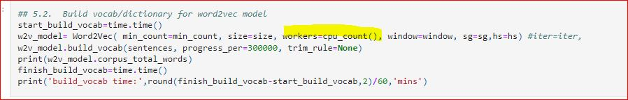
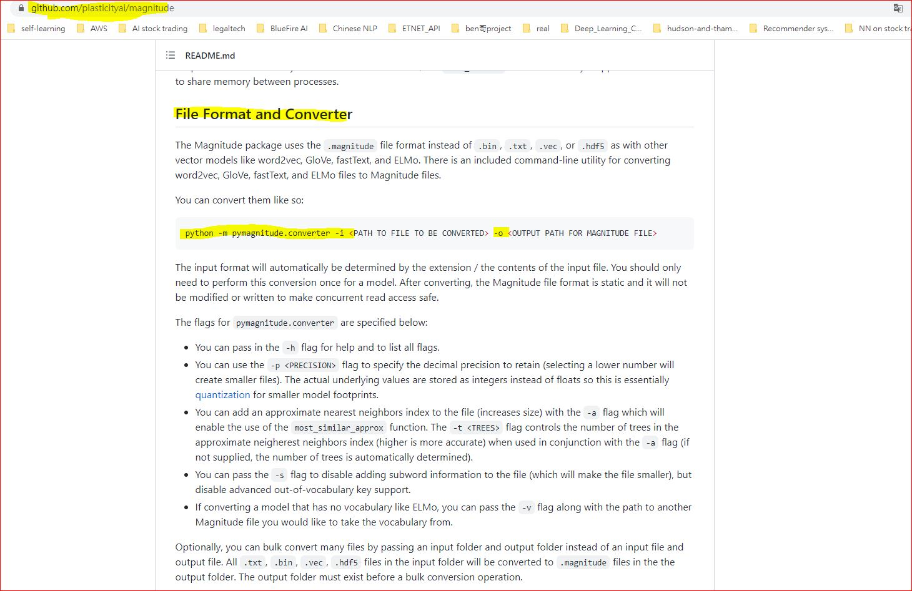
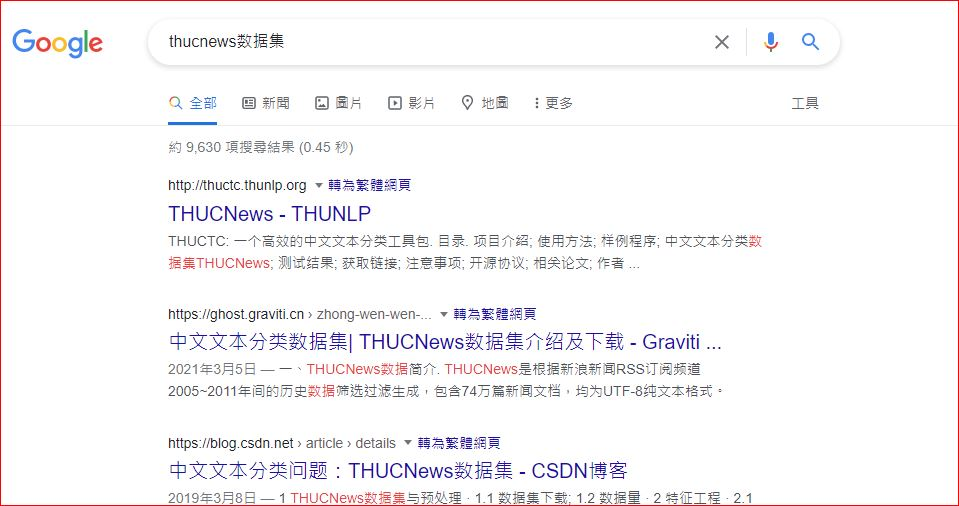
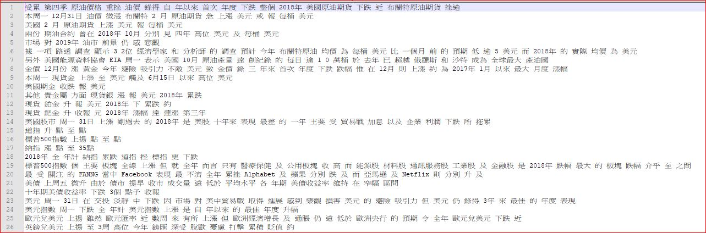
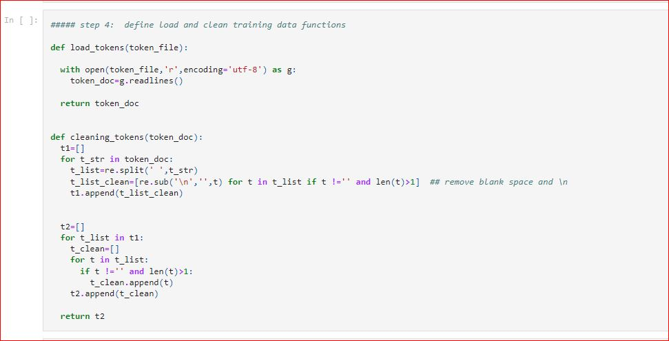
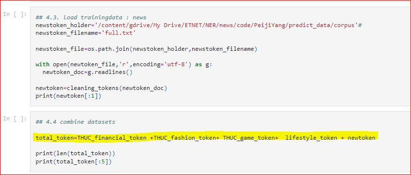
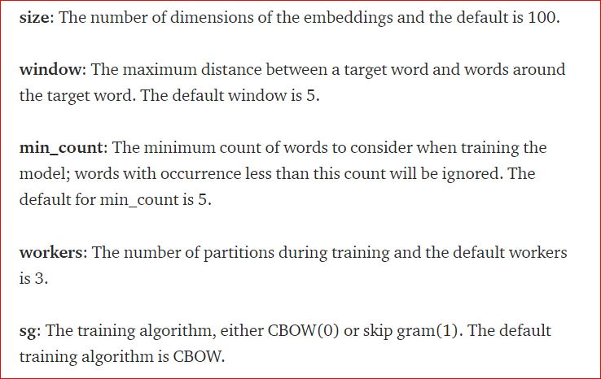
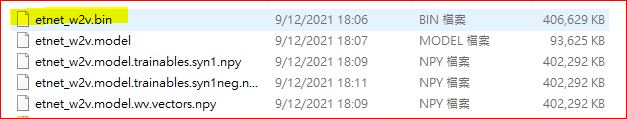
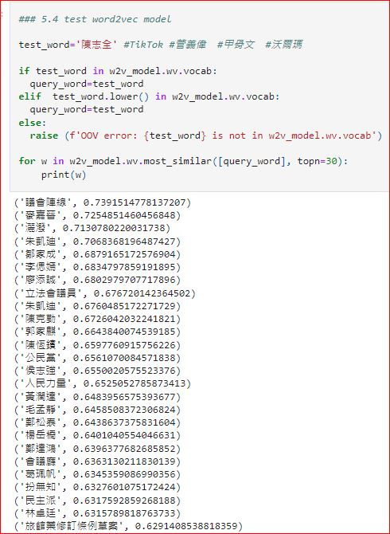

## Introduction of gensim word2vec model
Please refer to this url : https://towardsdatascience.com/a-beginners-guide-to-word-embedding-with-gensim-word2vec-model-5970fa56cc92

This repository focuses on how to train and deploy a self-developed word2vec model to reflect the word semantic relationship for Traditional Chinese Financial news.

## Background of this word2vec model

To balance between training and deployment, we use two differents set of open libraries for model training and deployment, respectively.
- training: [gensim](https://github.com/RaRe-Technologies/gensim)
- deployment: [pymagnitude](https://github.com/plasticityai/magnitude) for model format conversion and [pymagnitude-light](https://github.com/davebulaval/magnitude-light) for loading of trained model.
 
## why use [gensim](https://github.com/RaRe-Technologies/gensim) for model training?
[gensim](https://github.com/RaRe-Technologies/gensim) is designed to process raw, unstructured digital texts (”plain text”) using unsupervised machine learning algorithms.

The algorithms in Gensim, such as Word2Vec, FastText, etc, automatically discover the semantic structure of documents by examining statistical co-occurrence patterns within a corpus of training documents. 

Gensim is fully optimized to train a word embedding/word2vec model on local CPU environment(Non-GPU) with large dataset. Given the optimization of open-library, the training will take about 30 mins to complete based on the training dataset in the data folder 

## Model training environment
To reduce the consumption of computing resources during the model training process, user can fine-tune the numbers of workers in the instantiation of Word2Vec model shown below. 

We strongly advise to use google colab platform for training to reduce the resource burden of local machine. Please remember to register a google drive account before using google colab. Please remind no need to change instance to GPU when using gensim for word2vec model training as Gensim is cpu-only applicable.

### hyperparameter to control computing resources

 

## why use pymagnitude for deployment?

Gensim word2vec model cannot handle out-of-vocabulary (OOV) issue. The gensim-based model will raise error when the input string contains new terms and vocabularies which do not exist in the model dictionary stored in the model file. (e.g. NFT , Metaverse, etc)

To alleviate the OOV problem, we convert the gensim word2vec model to magnitutde format and load the model by [pymagnitude](https://github.com/plasticityai/magnitude) as pymagnitude is designed to load word2vec model with OOV strings as input and it intreprets OOV based on the sequences of characters.

### The commmand line for model conversion
- general:     python -m pymagnitude.converter -i <PATH TO FILE TO BE CONVERTED> -o <OUTPUT PATH FOR MAGNITUDE FILE>
- this repository:    python -m pymagnitude.converter -i  \word2vec_training\model\gensim\etnet_w2v.bin   -o  \word2vec_training\model\magnitude\boc_app_heavy.magnitude 

For the script and command line to convert gensim  to magnitude format, please refer to the github page of [pymagnitude](https://github.com/plasticityai/magnitude)
 
### Gensim model conversion to magnitude
 
  
For the detail of how to deploy word2vec model by  [pymagnitude](https://github.com/plasticityai/magnitude) and   and [pymagnitude-light](https://github.com/davebulaval/magnitude-light), please refer to the [deployment.py](https://github.com/etnetapp-dev/nlp_w2v_model/deployment.py)

------------------------------------------------------------------------------------------------------------------------------------------------------------------------
 
## Training of word2vec by gensim

### Training dataset

If local RAM is large enough, please increase the size of training data and data variety in order to achieve higher model accuracy.

In this repository, the training dataset is the combination of three dataset sources 
1. THUCNews (a well-known and widely used NLP dataset containing news articles about finance, gaming, fashion). The dataset can be easily searched and downloaded from internet
 
### ThUCnews dataset from internet

  
2. [Financial related articles from etnet lifestyle columns](https://github.com/etnetapp-dev/nlp_w2v_model/tree/master/data/lifestyle_finance/tokens)

3. [selected ETNET financial news articles produced between 2018 and 2020](https://github.com/etnetapp-dev/nlp_w2v_model/tree/master/data/etnet_news/tokens)

### data preparation

word2vec model training的input 只可以是 list of string or string ...

因此, 不能把未經過處理的中文句子或段落直接, 用作訓練之用。

以中文文章為例. 所以用來訓練的Input data ,必須經過三步處理:
1. 把文章分段成為句子, 可以句號或其他分割完整的句子的標點符號, 作為seperator
2. 把句子進行分詞(word segementation或 tokenization)  . 使句子變成 以空格分開的中文詞語.  建議使用結巴作為分詞工具..
3. 在完成分詞後, 把標點符號從文檔中移除, 包括, 包號, 逗號, 分號、感嘆號等...只留下文字部份.

在完成三個step後.  training dataset應該變成這個模樣:

文檔中每一行為一句.

每句之內, 每個詞語以空隔分開.

### Example of training dataset
    
  
 
如果句子內同時出現中文及英文, 也可以空隔作分隔, 但需要留意, 英文詞語是否專有名詞. 例如,  Donald Trump 等,, 應該把兩個英文字合併成一個單詞 DonaldTrump處理

有部份專有名詞是否採用空格分開, 或是合拼處理.... 可能需要人手作鑑定

  
我在製造語料數據時, 也花了好幾天, 用內眼去鑑定部份語料,  不可能做到100%準確, 但可提升詞語之間的準繩度

在完成語料準備後,    可在python script 內, input txt file 然後以'\n' 把句子分別, 再以空格分開每一句句子內的詞語, 結果造成list of string list

我在jupyner notebook內已有用作input txt file的function

### dataset input function
  
  
然後把 幾個 list of string list 合併在一起, 成為一個大集合. 這便是model input
  
### model input

### Model training
只要text input 成為list of string list 以及調教完成hyperparaemters 即可使用5.2-5.3進行訓練.   以github內已完成處理的語料, 在local machine 大概需時半小時. 

然後按照jupyter notebook 第五部份.. 自行調校訓練model 所需的hyper-parameter , For the meaning of hyper-parameter, please refer to this url: https://blog.csdn.net/szlcw1/article/details/52751314

### definition of Hyperparameters

 

我試過把size調升至500  發覺分別不大

然後在5.2-5.3 部份便是已寫好的model training 主要部份

5.5 部份便是把完成訓練的Model 存放在local machine 內指定位置  完成訓練的word2vec model....最主要的是.etnet_w2v.bin   因為bin file size較細... 使用時速度較良好
  
### gensim model after training

在完成訓練gensim word2vec model後. 建議不要馬上儲存. 應該在jupyter notebook 內, 對Model進行簡單測試... 如下圖

如上圖指,  輸入「陳志全」. 看看AI Model能否辨別出, 哪幾個詞語跟「陳志全」關係最密切, 結果出來以下字眼
  
### gensim model test

  
如果output字眼, 跟input字眼關係不大密切, 即model 效果欠佳. 建議先更改hyperparameter的設定,, 例如提升iter 次數, 或 減少window_size

### Model type conversion

但最重要... 即使model 效果良好, 但不要馬上在deployment上使用, 
因為gensim word2vec model有嚴重的OOV 問題... 即不能對部份新詞作出處理......強行使用會出現Error 情況, 因此必須把gensim model convert成為magnitude 模式..... 
然後使用pymagnitude-light 這個openlibrary進行deployment

你們會發現, 這裏有兩個pymagnitutde 的openlibrary
1. pymagnitude (https://github.com/plasticityai/magnitude)
2. pymagnitutde -light (https://github.com/davebulaval/magnitude-light)

現在解釋為何需要兩個不同的pymagnitude 

因為原始版本的pymagnitude (https://github.com/plasticityai/magnitude)  功能最齊全....所以應使用它作為工具, 把gensim word2vec model 轉換成 magnitude format.

但原始版本的pymagnitude 是重量級open-library 在deployment運作速度較慢. 因此, 本人只採用原始版本的pymagnitude 把gensim word2vec model 轉換為magnitude format 

然後採用size較細, deployment 速度快得多的pymagnitutde -light (https://github.com/davebulaval/magnitude-light) 進行 model deployment

model轉換的方法及command line 剛才已提及過.. 

#### deployment :
deployment 請自行看github 內的deployment.py 

